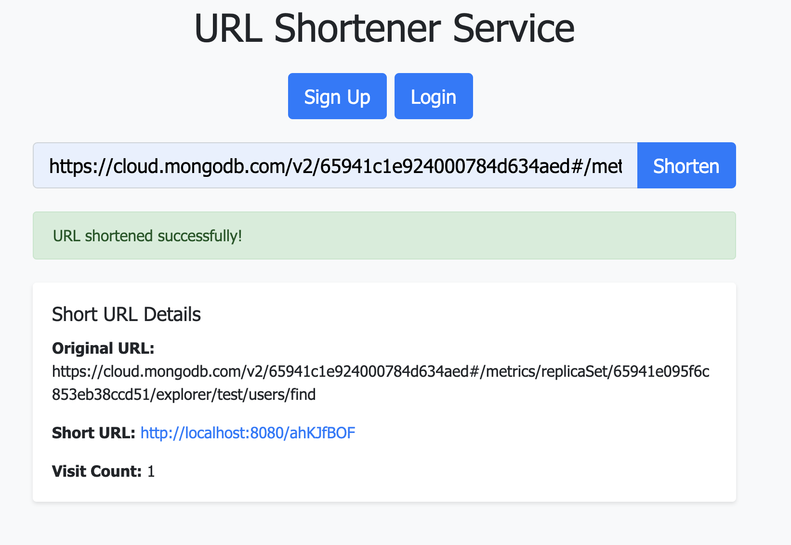
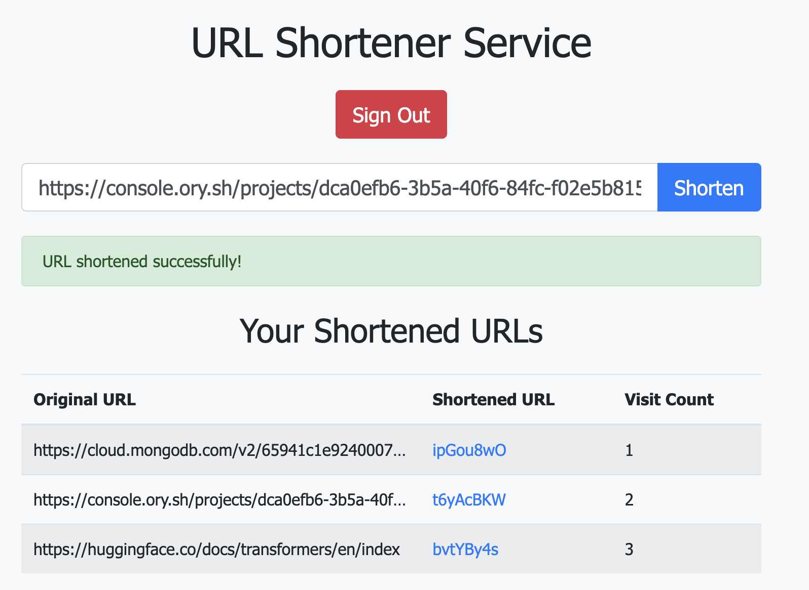

# URL Shortener

URL Shortener is a Go-based web application I designed for creating shortened URLs. It uses different backend and frontend tech stacks for URL management and URL shortening.

## Screenshots

### Guests

### Users

## Features

- **User Authentication**: Secure signup and login functionality with JWT tokens.
- **URL Shortening**: Users can create shortened URLs for long URLs.
- **URL Management**: Users can view and manage their shortened URLs and see click counts.
- **Responsive UI**: A frontend designed with Bootstrap for a responsive user experience.

## Technologies Used

- **Backend**: Go with Gorilla/Mux for routing, PostgreSQL for database interactions, and Redis for rate limiting.
- **Frontend**: HTML, CSS (Bootstrap), and JavaScript for dynamic content.
- **Database**: PostgreSQL for storing authenticated user and URL information, Redis for URL information for guests.
- **Authentication**: JSON Web Tokens (JWT) for secure user authentication.

## Getting Started

### Prerequisites

- Go
- PostgreSQL
- Redis
- Docker

### Installation

1. Clone the repository:

git clone https://github.com/heming277/url-shortener.git

cd url-shortener

2. Build and run the application with Docker-compose:

docker-compose up --build -d

The server will start, access the web application at `http://localhost:8080`.

## Usage

- Visit `http://localhost:8080` in the web browser.
- Start using as a Guest or Sign up for an account or log in.
- Start creating and managing shortened URLs.

## Contributing

Contributions are welcome! Please feel free to submit a pull request.

## License

This project is licensed under the MIT License - see the [LICENSE](LICENSE) file for details.
